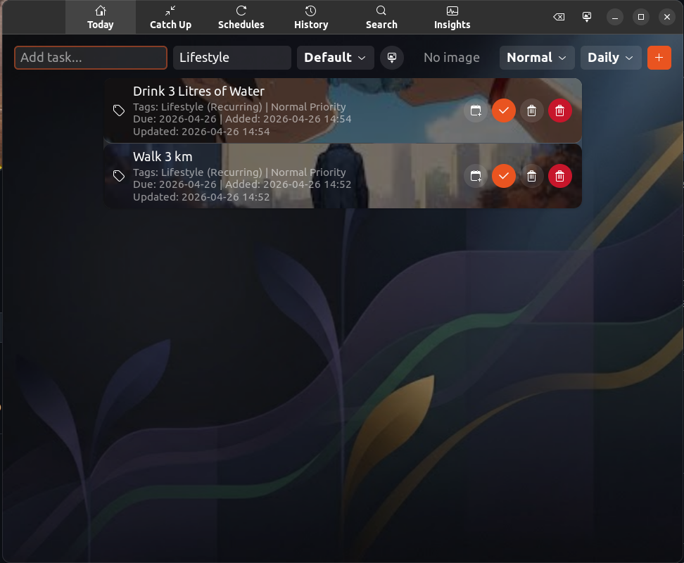

<div align="center">
  <h1>⚡ Native Linux To-Do App ⚡</h1>
  <p>A beautiful, database-backed, GTK4 & Libadwaita powered task manager built for Linux Power Users.</p>
</div>

<div align="center">
  
  
  
  
</div>

<br>

<div align="center">
  
  <br/>
  <sub><i>Elite To-Do — your tasks, beautifully managed.</i></sub>
</div>

<br>

## ✨ The Vision
This application breaks away from Electron-heavy web wrappers by offering a lightning-fast, beautifully designed, and highly functional native desktop client integrated perfectly into the GNOME/Linux ecosystem.

It comes packed with developer-centric workflows: from command-line quick adds to historical productivity analytics.

## 🚀 Features

- **🎨 Native GNOME UI**: Built entirely on GTK4 and Libadwaita for exquisite, adaptive, and dark-mode-ready rendering.
- **⚡ CLI Integration**: Add tasks and schedule configurations straight from your terminal without opening the app window.
- **🔥 Priority Engine**: Rank tasks as High, Normal, or Low. High-priority tasks instantly snap to the top of your feed.
- **🔄 Smart Scheduling**: Natively supports automatic recurring templates (`Daily`, `Weekly`, `Monthly`).
- **🔍 Global Search**: Traverse instantly through every task, past or pending, with cross-app text filtering.
- **📈 Analytics Dashboard**: Actively track your Weekly Success Rate, completed milestones, and miss-counts via the built-in Insights tool.
- **🗑️ Hard Deletions**: Permanently destroy mistaken tasks from the database so they never clutter your historical timeline!

## 📦 Requirements
Ensure you have the required GTK/Python stack installed on your Linux machine:

```bash
# Ubuntu / Debian systems:
sudo apt install python3-gi python3-gi-cairo gir1.2-gtk-4.0 gir1.2-adw-1 libgirepository1.0-dev

# Fedora systems:
sudo dnf install python3-gobject gtk4 libadwaita
```

## 🛠️ Usage

### Launching the Graphical Interface
Simply run the script. It boots instantly to the "Today" page.
```bash
python3 app.py
```

### Command Line (Quick Add)
You can directly interact with the database, bypassing the GUI frame for ultimate speed.

```bash
# Standard task
python3 app.py add "Review PRs" -c Code

# High Priority task due tomorrow
python3 app.py add "Production outage" -c Work -p High -d 2026-04-26

# Recurring daily scheduled task
python3 app.py add "Review open tickets" -c Work -r Daily
```

## 🗃️ Under the Hood
All tasks and metrics are tightly secured onto your local machine in an SQLite format located at:
`~/.local/share/python_todo_app/todos.db`

If you ever wish to nuke everything and start completely from scratch, simply delete that `.db` file!

---
*Architected natively for the Linux programming workflow.*
